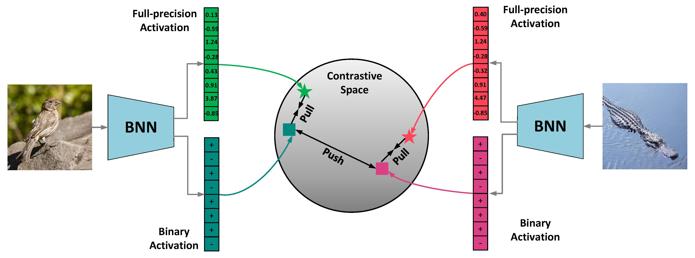

# CMIM: Network Binarization via Contrastive Learning
**Yuzhang Shang**, Dan Xu, Ziliang Zong, Liqiang Nie, and Yan Yan    

The code for the Network Binarization via Contrastive Learning, which has been accepted to ECCV 2022. [paper](https://arxiv.org/abs/2207.02970)

    
General Idea of CMIM: Feeding two images into a BNN, and obtaining the three pairs of binary and full-precision activations. Our goal is to embed the activations into a contrastive space, then learn from the pair correlation with the contrastive learning task in Eq.13.

## Quick Start
First, download our repo:
```bash
git clone https://github.com/42Shawn/CMIM.git
cd CMIM/cifar100
```
Then, run our repo:
```bash
python main.py --save='v0' --data_path='path-to-dataset' --gpus='gpu-id' --alpha=3.2
```
Note that the alpha can be change to conduct ablation studies, and alpha=0 is equal to RBNN itself.    
**Demo Result**   
RBNN (alpha = 0) => CMIM (alpha = 3.2)    
            65.4 => 71.2

# Reference
If you find our code useful for your research, please cite our paper.
```
@inproceedings{
shang2022cmim,
title={Network Binarization via Contrastive Learning},
author={Yuzhang Shang and Dan Xu and Ziliang Zong and Liqiang Nie and Yan Yan},
booktitle={ECCV},
year={2022}
}
```

**Related Work**    
Our repo is modified based on the Pytorch implementations of Forward and Backward Information Retention for Accurate Binary Neural Networks ([IR-Net](https://github.com/htqin/IR-Net), CVPR 2020) and Rotated Binary Neural Network ([RBNN](https://github.com/lmbxmu/RBNN), NeurIPS 2020). Thanks to the authors for releasing their codebases!
